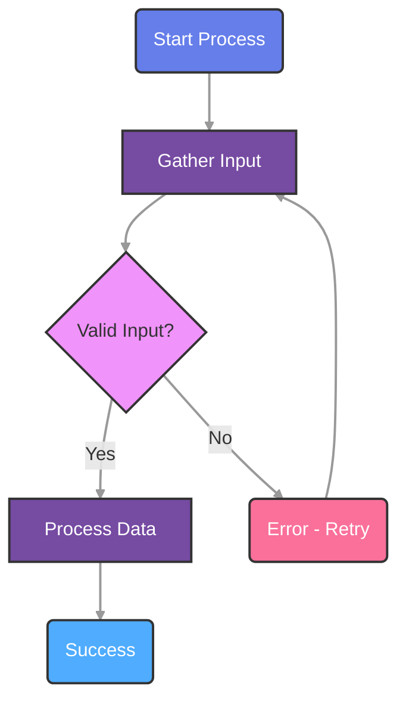

# Mermaid Diagram Generator

## Overview

The mermaid-generator skill creates interactive workflow diagrams using the Mermaid JavaScript library. It generates complete MicroSim packages with standalone HTML files featuring colorful backgrounds, 16-point fonts, and top-down rendering by default for educational textbooks.

## Purpose

This skill automates the creation of professional flowcharts, process diagrams, workflow visualizations, and decision trees that are immediately ready for embedding in MkDocs sites or standalone use.

## Key Features

- **Top-Down Flowcharts**: Default TD (top-down) direction for optimal readability
- **Colorful Node Backgrounds**: Vibrant, educational-friendly color schemes
- **16-Point Fonts**: Optimal readability from back of classroom
- **Interactive Controls**: Zoom and export functionality
- **Complete MicroSim Package**: HTML, CSS, JavaScript, documentation, and metadata
- **MkDocs Integration**: Ready for iframe embedding

## When to Use

Use this skill when users request:
- Workflow diagrams or process flows
- Decision trees with branching logic
- Algorithm visualizations
- System architecture flows
- Educational process diagrams
- Step-by-step procedure illustrations
- State transition diagrams
- Any flowchart-style visualization

## Common Trigger Phrases

- "Create a flowchart showing..."
- "Generate a workflow diagram for..."
- "Make a decision tree for..."
- "Visualize the process of..."

## Workflow Steps

### Step 1: Gather Requirements
- Diagram purpose and workflow being illustrated
- Key steps/nodes in the workflow
- Decision points (branching if/then logic)
- Flow direction (top-down, left-right)
- Start and end points

### Step 2: Design Mermaid Flowchart
- Choose node shapes (rectangles, diamonds, circles)
- Select color palette (vibrant, professional, ocean, custom)
- Define style classes for consistent theming
- Ensure 16pt fonts for all elements
- Use top-down direction by default

### Step 3: Create MicroSim Structure
```
docs/sims/[diagram-name]/
├── main.html         # Standalone visualization
├── style.css         # Responsive styling
├── script.js         # Interactive features
├── index.md          # Documentation
└── metadata.json     # Dublin Core metadata
```

### Step 4: Generate Files from Templates
- Replace placeholders with actual content
- Embed Mermaid code in main.html
- Configure zoom and export features
- Create comprehensive documentation

### Step 5: Validate and Test
- Syntax validation
- File structure verification
- Font size confirmation (16px)
- Color contrast check
- Responsive design testing

## Node Shapes and Purposes

- **Rounded rectangles** `("Label")`: Start/end points
- **Rectangles** `["Label"]`: Process steps
- **Diamonds** `{"Decision?"}`: Decision points
- **Circles** `(("Label"))`: Connectors

## Color Palettes

### Vibrant (Purple/Blue/Pink)
- Engaging diagrams for educational content
- High contrast for visibility

### Professional (Turquoise/Mint/Coral)
- Formal content
- Business process flows

### Ocean (Blue Spectrum)
- Technical content
- System architecture

### Custom
- Match textbook theme
- Brand colors

## Mermaid Syntax Example



## Interactive Features

- **Zoom Controls**: Zoom in/out for large diagrams
- **Export to SVG**: Save diagrams for presentations
- **Node Interaction Tracking**: Monitor student engagement
- **Accessibility Features**: Keyboard navigation support

## Output Structure

Each generated diagram includes:
- `main.html`: Standalone interactive diagram with Mermaid.js
- `style.css`: Responsive styling with 16px fonts and print-friendly rules
- `script.js`: Zoom controls, export functionality, interaction tracking
- `index.md`: MkDocs integration page with overview and usage guide
- `metadata.json`: Dublin Core metadata for searchability

## Metadata Fields

- Title and description
- Subject area
- Publication date
- Target audience
- Node and edge counts
- Concepts illustrated
- Bloom's Taxonomy level
- Version and dependencies

## MkDocs Integration

Add to navigation in `mkdocs.yml`:

```yaml
nav:
  - Visualizations:
    - Software Lifecycle: sims/software-lifecycle/index.md
```

Or integrate into chapter navigation:

```yaml
nav:
  - Chapter 3:
    - Introduction: chapters/03/index.md
    - Workflow Diagram: sims/workflow/index.md
```

## Best Practices

### Design Principles
1. **Clarity over Complexity**: Keep diagrams focused—break complex flows into multiple diagrams
2. **Consistent Styling**: Use same color palette across related diagrams
3. **Meaningful Labels**: Clear, concise labels (2-5 words max per node)
4. **Logical Flow**: Ensure arrows flow in expected reading direction
5. **Color Semantics**: Use colors consistently (green=success, red=errors)

### Accessibility
1. **Font Size**: Always 16px minimum for readability
2. **Color Contrast**: Ensure WCAG AA compliance (4.5:1)
3. **Text Alternatives**: Provide descriptive text in index.md
4. **Semantic HTML**: Use proper heading structure

### Educational Integration
1. **Align with Learning Goals**: Map to specific objectives
2. **Bloom's Taxonomy**: Tag with appropriate cognitive level
3. **Concept Dependencies**: Link to prerequisite concepts
4. **Practice Exercises**: Include comprehension questions

## Common Patterns

### Linear Process Flow
```
Start → Step 1 → Step 2 → Step 3 → End
```

### Decision Tree
```
Start → Decision 1 (Yes/No)
  ├─ Yes → Action A → End
  └─ No → Decision 2 (Yes/No)
      ├─ Yes → Action B → End
      └─ No → Action C → End
```

### Loop/Iteration
```
Start → Initialize → Process → Check Complete?
  ├─ No → Process (loop back)
  └─ Yes → End
```

### Error Handling
```
Start → Try Action → Success?
  ├─ Yes → Continue → End
  └─ No → Error Handler → Retry or Exit
```

## Troubleshooting

### Issue: Mermaid code doesn't render
**Solution**: Check for syntax errors (missing quotes/brackets), verify flowchart TD is first line

### Issue: Fonts not 16px
**Solution**: Verify `font-size:16px` in all classDef declarations and linkStyle

### Issue: Colors not showing
**Solution**: Confirm classDef declarations come after flowchart code and verify `:::className` syntax

### Issue: Diagram too large/small
**Solution**: Adjust node count (split if >15 nodes) or modify CSS max-width

### Issue: Labels cut off
**Solution**: Shorten text, use markdown strings for wrapping, increase container width

## Integration with Other Skills

- **learning-graph-generator**: Create diagrams for learning concepts
- **chapter-content-generator**: Embed diagrams in chapter content
- **microsim-p5**: Use Mermaid for static workflows, p5.js for dynamic simulations
- **quiz-generator**: Create questions about workflow understanding
- **glossary-generator**: Define terms used in diagram labels

## References

- Mermaid.js Documentation: https://mermaid.js.org/
- MkDocs Material Theme: https://squidfunk.github.io/mkdocs-material/
- Flowchart Syntax: https://mermaid.js.org/syntax/flowchart.html
