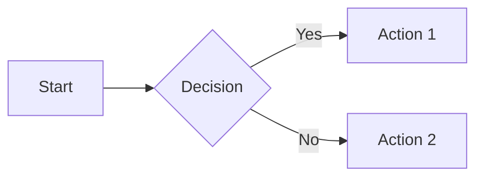

# MkDocs Feature Enhancements

This guide lists all the features that can be added to an MkDocs Material intelligent textbook. Each feature includes the required mkdocs.yml configuration and any additional setup steps.

## Quick Reference: Available Features

| Feature | Category | Complexity |
|---------|----------|------------|
| [Math Equations (MathJax)](#math-equations-mathjax) | Content | Easy |
| [Math Equations (KaTeX)](#math-equations-katex) | Content | Easy |
| [Code Syntax Highlighting](#code-syntax-highlighting) | Content | Easy |
| [Code Copy Button](#code-copy-button) | Content | Easy |
| [Social Media Preview Cards](#social-media-preview-cards) | SEO | Medium |
| [Per-Page Social Image Override](#per-page-social-image-override) | SEO | Medium |
| [Custom Admonitions with Copy](#custom-admonitions-with-copy) | Content | Medium |
| [Interactive Quizzes](#interactive-quizzes) | Educational | Medium |
| [Simple Feedback (Thumbs)](#simple-feedback-thumbs-updown) | Engagement | Easy |
| [Detailed Comment Feedback (Giscus)](#detailed-comment-feedback-giscus) | Engagement | Medium |
| [Image Zoom on Click (GLightbox)](#image-zoom-on-click-glightbox) | Content | Easy |
| [Mermaid Diagrams](#mermaid-diagrams) | Content | Easy |
| [Content Tabs](#content-tabs) | Content | Easy |
| [Task Lists](#task-lists) | Content | Easy |
| [Abbreviations & Glossary Tooltips](#abbreviations--glossary-tooltips) | Content | Easy |
| [Navigation Tabs](#navigation-tabs) | Navigation | Easy |
| [Table of Contents Sidebar](#table-of-contents-sidebar) | Navigation | Easy |
| [Search with Suggestions](#search-with-suggestions) | Navigation | Easy |
| [Tags & Categorization](#tags--categorization) | Organization | Medium |
| [Blog Support](#blog-support) | Content | Medium |
| [Privacy & Cookie Consent](#privacy--cookie-consent) | Legal | Easy |
| [Announcement Bar](#announcement-bar) | Engagement | Easy |

---

## Content Features

### Math Equations (MathJax)

Add LaTeX math equation support using MathJax for rendering.

**Add to mkdocs.yml:**

```yaml
markdown_extensions:
  - pymdownx.arithmatex:
      generic: true

extra_javascript:
  - javascripts/mathjax.js
  - https://unpkg.com/mathjax@3/es5/tex-mml-chtml.js
```

**Create `docs/javascripts/mathjax.js`:**

```javascript
window.MathJax = {
  tex: {
    inlineMath: [["\\(", "\\)"]],
    displayMath: [["\\[", "\\]"]],
    processEscapes: true,
    processEnvironments: true
  },
  options: {
    ignoreHtmlClass: ".*|",
    processHtmlClass: "arithmatex"
  }
};

document$.subscribe(() => {
  MathJax.startup.output.clearCache()
  MathJax.typesetClear()
  MathJax.texReset()
  MathJax.typesetPromise()
})
```

**Usage in markdown:**

```markdown
Inline: \( E = mc^2 \)

Display:
\[
\int_0^\infty e^{-x^2} dx = \frac{\sqrt{\pi}}{2}
\]
```

---

### Math Equations (KaTeX)

Faster alternative to MathJax using KaTeX.

**Add to mkdocs.yml:**

```yaml
markdown_extensions:
  - pymdownx.arithmatex:
      generic: true

extra_javascript:
  - javascripts/katex.js
  - https://unpkg.com/katex@0/dist/katex.min.js
  - https://unpkg.com/katex@0/dist/contrib/auto-render.min.js

extra_css:
  - https://unpkg.com/katex@0/dist/katex.min.css
```

**Create `docs/javascripts/katex.js`:**

```javascript
document$.subscribe(({ body }) => {
  renderMathInElement(body, {
    delimiters: [
      { left: "$$",  right: "$$",  display: true },
      { left: "$",   right: "$",   display: false },
      { left: "\\(", right: "\\)", display: false },
      { left: "\\[", right: "\\]", display: true }
    ],
  })
})
```

---

### Code Syntax Highlighting

Enable syntax highlighting for code blocks with language support.

**Add to mkdocs.yml:**

```yaml
markdown_extensions:
  - pymdownx.highlight:
      anchor_linenums: true
      line_spans: __span
      pygments_lang_class: true
  - pymdownx.inlinehilite
  - pymdownx.snippets
  - pymdownx.superfences
```

**Usage:**

````markdown
```python
def hello_world():
    print("Hello, World!")
```
````

---

### Code Copy Button

Add a copy-to-clipboard button on all code blocks.

**Add to mkdocs.yml:**

```yaml
theme:
  name: material
  features:
    - content.code.copy
    - content.code.select
    - content.code.annotate
```

---

### Mermaid Diagrams

Enable Mermaid.js diagrams directly in markdown.

**Add to mkdocs.yml:**

```yaml
markdown_extensions:
  - pymdownx.superfences:
      custom_fences:
        - name: mermaid
          class: mermaid
          format: !!python/name:pymdownx.superfences.fence_code_format
```

**Usage:**

````markdown

````

---

### Content Tabs

Create tabbed content sections for organizing related information.

**Add to mkdocs.yml:**

```yaml
markdown_extensions:
  - pymdownx.superfences
  - pymdownx.tabbed:
      alternate_style: true
      slugify: !!python/object/apply:pymdownx.slugs.slugify
        kwds:
          case: lower
```

**Usage:**

```markdown
=== "Python"

    ```python
    print("Hello")
    ```

=== "JavaScript"

    ```javascript
    console.log("Hello");
    ```
```

---

### Task Lists

Enable GitHub-style task lists with checkboxes.

**Add to mkdocs.yml:**

```yaml
markdown_extensions:
  - pymdownx.tasklist:
      custom_checkbox: true
```

**Usage:**

```markdown
- [x] Completed task
- [ ] Incomplete task
- [ ] Another task
```

---

### Abbreviations & Glossary Tooltips

Define abbreviations that show tooltips on hover throughout your site.

**Add to mkdocs.yml:**

```yaml
markdown_extensions:
  - abbr
  - pymdownx.snippets:
      auto_append:
        - includes/abbreviations.md
```

**Create `docs/includes/abbreviations.md`:**

```markdown
*[HTML]: Hyper Text Markup Language
*[CSS]: Cascading Style Sheets
*[API]: Application Programming Interface
*[DAG]: Directed Acyclic Graph
```

Terms will automatically show tooltips when hovered anywhere in the documentation.

---

## Custom Admonitions with Copy

### Custom Admonitions with Copy

Create custom admonition types like "Prompt" with a copy button for easy copying of content.

**Add to mkdocs.yml:**

```yaml
markdown_extensions:
  - admonition
  - pymdownx.details
  - pymdownx.superfences

extra_css:
  - css/custom-admonitions.css

extra_javascript:
  - javascripts/copy-admonition.js
```

**Create `docs/css/custom-admonitions.css`:**

```css
/* Custom Prompt Admonition */
.md-typeset .admonition.prompt,
.md-typeset details.prompt {
  border-color: #7c4dff;
}

.md-typeset .prompt > .admonition-title,
.md-typeset .prompt > summary {
  background-color: rgba(124, 77, 255, 0.1);
}

.md-typeset .prompt > .admonition-title::before,
.md-typeset .prompt > summary::before {
  background-color: #7c4dff;
  -webkit-mask-image: var(--md-admonition-icon--prompt);
  mask-image: var(--md-admonition-icon--prompt);
}

:root {
  --md-admonition-icon--prompt: url('data:image/svg+xml;charset=utf-8,<svg xmlns="http://www.w3.org/2000/svg" viewBox="0 0 24 24"><path d="M20 2H4c-1.1 0-2 .9-2 2v12c0 1.1.9 2 2 2h14l4 4V4c0-1.1-.9-2-2-2zm-2 12H6v-2h12v2zm0-3H6V9h12v2zm0-3H6V6h12v2z"/></svg>');
}

/* Copy button styling */
.admonition-copy-btn {
  position: absolute;
  top: 8px;
  right: 8px;
  padding: 4px 8px;
  background: rgba(0,0,0,0.1);
  border: none;
  border-radius: 4px;
  cursor: pointer;
  font-size: 12px;
}

.admonition-copy-btn:hover {
  background: rgba(0,0,0,0.2);
}

.admonition.prompt {
  position: relative;
}
```

**Create `docs/javascripts/copy-admonition.js`:**

```javascript
document$.subscribe(function() {
  document.querySelectorAll('.admonition.prompt').forEach(function(admonition) {
    // Skip if already has a copy button
    if (admonition.querySelector('.admonition-copy-btn')) return;

    var btn = document.createElement('button');
    btn.className = 'admonition-copy-btn';
    btn.textContent = 'Copy';
    btn.onclick = function() {
      var content = admonition.querySelector('.admonition-title + p, .admonition-title ~ *:not(.admonition-copy-btn)');
      if (content) {
        navigator.clipboard.writeText(content.textContent.trim());
        btn.textContent = 'Copied!';
        setTimeout(function() { btn.textContent = 'Copy'; }, 2000);
      }
    };
    admonition.style.position = 'relative';
    admonition.appendChild(btn);
  });
});
```

**Usage:**

```markdown
!!! prompt "Example Prompt"

    Write a Python function that calculates the Fibonacci sequence
    up to n terms using recursion with memoization.
```

---

## Educational Features

### Interactive Quizzes

Add self-assessment quizzes using the mkdocs-quiz plugin or custom JavaScript.

**Option 1: Using custom JavaScript (no plugin required)**

**Add to mkdocs.yml:**

```yaml
extra_javascript:
  - javascripts/quiz.js

extra_css:
  - css/quiz.css
```

**Create `docs/javascripts/quiz.js`:**

```javascript
document$.subscribe(function() {
  document.querySelectorAll('.quiz-question').forEach(function(question) {
    var options = question.querySelectorAll('.quiz-option');
    var feedback = question.querySelector('.quiz-feedback');

    options.forEach(function(option) {
      option.addEventListener('click', function() {
        options.forEach(function(o) { o.classList.remove('selected'); });
        option.classList.add('selected');

        if (option.dataset.correct === 'true') {
          feedback.textContent = 'Correct!';
          feedback.className = 'quiz-feedback correct';
        } else {
          feedback.textContent = 'Try again!';
          feedback.className = 'quiz-feedback incorrect';
        }
        feedback.style.display = 'block';
      });
    });
  });
});
```

**Create `docs/css/quiz.css`:**

```css
.quiz-question {
  background: var(--md-code-bg-color);
  padding: 1rem;
  border-radius: 8px;
  margin: 1rem 0;
}

.quiz-option {
  display: block;
  padding: 0.5rem 1rem;
  margin: 0.5rem 0;
  background: var(--md-default-bg-color);
  border: 2px solid var(--md-default-fg-color--lighter);
  border-radius: 4px;
  cursor: pointer;
  transition: all 0.2s;
}

.quiz-option:hover {
  border-color: var(--md-accent-fg-color);
}

.quiz-option.selected {
  border-color: var(--md-accent-fg-color);
  background: rgba(var(--md-accent-fg-color--rgb), 0.1);
}

.quiz-feedback {
  display: none;
  padding: 0.5rem;
  margin-top: 0.5rem;
  border-radius: 4px;
  font-weight: bold;
}

.quiz-feedback.correct {
  background: rgba(0, 200, 83, 0.2);
  color: #00c853;
}

.quiz-feedback.incorrect {
  background: rgba(255, 82, 82, 0.2);
  color: #ff5252;
}
```

**Usage in markdown:**

```html
<div class="quiz-question">
  <p><strong>What is a Directed Acyclic Graph (DAG)?</strong></p>
  <div class="quiz-option" data-correct="false">A graph with cycles</div>
  <div class="quiz-option" data-correct="true">A directed graph with no cycles</div>
  <div class="quiz-option" data-correct="false">An undirected graph</div>
  <div class="quiz-option" data-correct="false">A tree structure only</div>
  <div class="quiz-feedback"></div>
</div>
```

---

## SEO Features

### Social Media Preview Cards

Automatically generate Open Graph and Twitter Card images for social sharing.

**Add to mkdocs.yml:**

```yaml
plugins:
  - social:
      cards_layout_options:
        background_color: "#4051b5"
        color: "#ffffff"
```

**Requirements:**
- Install dependencies: `pip install pillow cairosvg`
- On macOS: `brew install cairo pango gdk-pixbuf libffi`

---

### Per-Page Social Image Override

Override the auto-generated social card with a custom image for specific pages.

**Install the social_override plugin:**

**Create `plugins/social_override.py`:**

```python
from mkdocs.plugins import BasePlugin
from mkdocs.config import config_options

class SocialOverridePlugin(BasePlugin):
    config_scheme = (
        ('enabled', config_options.Type(bool, default=True)),
    )

    def on_page_context(self, context, page, config, nav):
        if page.meta.get('image'):
            image_path = page.meta['image']
            if not image_path.startswith(('http://', 'https://')):
                image_path = config['site_url'].rstrip('/') + '/' + image_path.lstrip('/')
            context['page'].meta['image'] = image_path
        return context
```

**Create `setup.py`:**

```python
from setuptools import setup

setup(
    name='mkdocs-social-override',
    version='1.0.0',
    packages=['plugins'],
    entry_points={
        'mkdocs.plugins': [
            'social_override = plugins.social_override:SocialOverridePlugin',
        ]
    }
)
```

**Install:** `pip install -e .`

**Add to mkdocs.yml:**

```yaml
plugins:
  - social_override
  - social
```

**Usage in page frontmatter:**

```yaml
---
title: My Special Page
image: img/custom-social-card.png
---
```

---

## Engagement Features

### Simple Feedback (Thumbs Up/Down)

Add simple page feedback with thumbs up/down buttons.

**Add to mkdocs.yml:**

```yaml
extra_javascript:
  - javascripts/feedback.js

extra_css:
  - css/feedback.css
```

**Create `docs/javascripts/feedback.js`:**

```javascript
document$.subscribe(function() {
  var feedback = document.createElement('div');
  feedback.className = 'page-feedback';
  feedback.innerHTML = `
    <p>Was this page helpful?</p>
    <button class="feedback-btn" data-value="yes">👍 Yes</button>
    <button class="feedback-btn" data-value="no">👎 No</button>
    <span class="feedback-thanks" style="display:none;">Thanks for your feedback!</span>
  `;

  var content = document.querySelector('.md-content__inner');
  if (content) {
    content.appendChild(feedback);
  }

  feedback.querySelectorAll('.feedback-btn').forEach(function(btn) {
    btn.addEventListener('click', function() {
      var value = this.dataset.value;
      // Send to analytics or backend
      console.log('Feedback:', value, 'Page:', window.location.pathname);

      // Optional: Send to Google Analytics
      if (typeof gtag !== 'undefined') {
        gtag('event', 'page_feedback', {
          'event_category': 'feedback',
          'event_label': window.location.pathname,
          'value': value === 'yes' ? 1 : 0
        });
      }

      feedback.querySelectorAll('.feedback-btn').forEach(function(b) { b.style.display = 'none'; });
      feedback.querySelector('.feedback-thanks').style.display = 'inline';
    });
  });
});
```

**Create `docs/css/feedback.css`:**

```css
.page-feedback {
  margin-top: 2rem;
  padding: 1rem;
  background: var(--md-code-bg-color);
  border-radius: 8px;
  text-align: center;
}

.feedback-btn {
  padding: 0.5rem 1rem;
  margin: 0 0.5rem;
  border: none;
  border-radius: 4px;
  cursor: pointer;
  font-size: 1rem;
  background: var(--md-primary-fg-color);
  color: var(--md-primary-bg-color);
}

.feedback-btn:hover {
  opacity: 0.8;
}

.feedback-thanks {
  color: var(--md-accent-fg-color);
  font-weight: bold;
}
```

---

### Detailed Comment Feedback (Giscus)

Enable GitHub Discussions-powered comments using Giscus.

**Prerequisites:**
1. Enable GitHub Discussions on your repository
2. Install Giscus app: https://github.com/apps/giscus
3. Configure at: https://giscus.app

**Add to mkdocs.yml:**

```yaml
extra:
  giscus:
    repo: "username/repo-name"
    repo_id: "R_xxxxx"
    category: "Announcements"
    category_id: "DIC_xxxxx"
    mapping: "pathname"
    reactions_enabled: "1"
    emit_metadata: "0"
    theme: "preferred_color_scheme"
    lang: "en"
```

**Create `docs/javascripts/giscus.js`:**

```javascript
document$.subscribe(function() {
  var container = document.createElement('div');
  container.className = 'giscus-container';

  var content = document.querySelector('.md-content__inner');
  if (content && !document.querySelector('.giscus')) {
    content.appendChild(container);

    var script = document.createElement('script');
    script.src = 'https://giscus.app/client.js';
    script.dataset.repo = '{{ config.extra.giscus.repo }}';
    script.dataset.repoId = '{{ config.extra.giscus.repo_id }}';
    script.dataset.category = '{{ config.extra.giscus.category }}';
    script.dataset.categoryId = '{{ config.extra.giscus.category_id }}';
    script.dataset.mapping = '{{ config.extra.giscus.mapping }}';
    script.dataset.reactionsEnabled = '{{ config.extra.giscus.reactions_enabled }}';
    script.dataset.emitMetadata = '{{ config.extra.giscus.emit_metadata }}';
    script.dataset.theme = '{{ config.extra.giscus.theme }}';
    script.dataset.lang = '{{ config.extra.giscus.lang }}';
    script.crossOrigin = 'anonymous';
    script.async = true;

    container.appendChild(script);
  }
});
```

**Add to mkdocs.yml:**

```yaml
extra_javascript:
  - javascripts/giscus.js
```

---

### Image Zoom on Click (GLightbox)

Enable lightbox zoom for images when clicked.

**Install:** `pip install mkdocs-glightbox`

**Add to mkdocs.yml:**

```yaml
plugins:
  - glightbox:
      touchNavigation: true
      loop: false
      effect: zoom
      slide_effect: slide
      width: 100%
      height: auto
      zoomable: true
      draggable: true
      auto_caption: false
      caption_position: bottom
```

All images will now be zoomable on click. To exclude specific images:

```markdown
{ .off-glb }
```

---

## Navigation Features

### Navigation Tabs

Add top-level navigation tabs for major sections.

**Add to mkdocs.yml:**

```yaml
theme:
  name: material
  features:
    - navigation.tabs
    - navigation.tabs.sticky
```

---

### Table of Contents Sidebar

Configure the right-side table of contents.

**Add to mkdocs.yml:**

```yaml
theme:
  name: material
  features:
    - navigation.indexes
    - toc.follow
    - toc.integrate  # Integrate TOC into left sidebar

markdown_extensions:
  - toc:
      permalink: true
      toc_depth: 3
```

---

### Search with Suggestions

Enable advanced search with suggestions and highlighting.

**Add to mkdocs.yml:**

```yaml
plugins:
  - search:
      separator: '[\s\-,:!=\[\]()"/]+|(?!\b)(?=[A-Z][a-z])|\.(?!\d)|&[lg]t;'

theme:
  name: material
  features:
    - search.suggest
    - search.highlight
    - search.share
```

---

## Organization Features

### Tags & Categorization

Add tags to pages for categorization and filtering.

**Add to mkdocs.yml:**

```yaml
plugins:
  - tags:
      tags_file: tags.md

markdown_extensions:
  - meta
```

**Create `docs/tags.md`:**

```markdown
# Tags

[TAGS]
```

**Usage in page frontmatter:**

```yaml
---
tags:
  - learning-graph
  - educational
  - beginner
---
```

---

### Blog Support

Add a blog section to your documentation.

**Add to mkdocs.yml:**

```yaml
plugins:
  - blog:
      blog_dir: blog
      post_date_format: long
      archive_name: Archive
      categories_name: Categories
```

**Create `docs/blog/.authors.yml`:**

```yaml
authors:
  author_name:
    name: Author Name
    description: Author description
    avatar: https://github.com/username.png
```

---

## Legal & Compliance

### Privacy & Cookie Consent

Add GDPR-compliant cookie consent banner.

**Add to mkdocs.yml:**

```yaml
extra:
  consent:
    title: Cookie consent
    description: >-
      We use cookies to recognize your repeated visits and preferences, as well
      as to measure the effectiveness of our documentation and whether users
      find what they're searching for. With your consent, you're helping us to
      make our documentation better.
    actions:
      - accept
      - reject
      - manage
```

---

### Announcement Bar

Add a dismissible announcement banner at the top of pages.

**Add to mkdocs.yml:**

```yaml
theme:
  name: material
  custom_dir: overrides

extra:
  announcement: "🎉 New version 2.0 released! <a href='/changelog/'>See what's new</a>"
```

**Create `overrides/main.html`:**

```html



  {{ config.extra.announcement | safe }}

```

---

## How to Use This Guide

1. **Identify the feature** you want to add from the table above
2. **Read the prerequisites** - some features require pip packages
3. **Copy the mkdocs.yml configuration** to your project
4. **Create any required files** (JavaScript, CSS, templates)
5. **Test locally** with `mkdocs serve`
6. **Deploy** when satisfied

## Minimal to Full-Featured Workflow

If starting with a minimal mkdocs.yml, add features incrementally:

1. **Essential first:** Code highlighting, admonitions, math
2. **Navigation:** Search, TOC, tabs
3. **SEO:** Social cards, meta tags
4. **Engagement:** Feedback, comments
5. **Educational:** Quizzes, interactive elements

## Troubleshooting

### Feature not working?

1. Check that all required extensions are listed in `markdown_extensions`
2. Verify JavaScript/CSS files are in correct locations
3. Clear browser cache and MkDocs cache (`mkdocs build --clean`)
4. Check browser console for JavaScript errors

### Plugin conflicts?

Order plugins carefully in mkdocs.yml - some plugins must come before others:
```yaml
plugins:
  - search  # Usually first
  - social_override  # Before social
  - social
  - tags
  - glightbox
```
